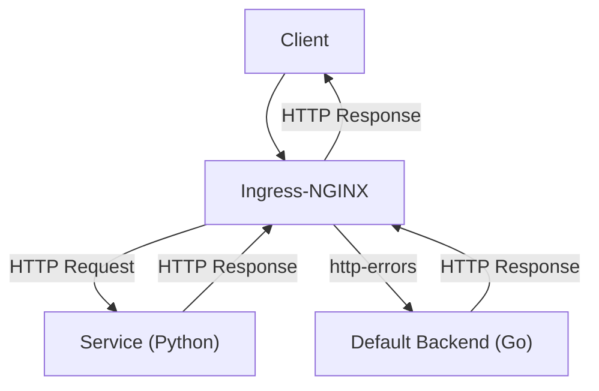

# Echo-Back

[](https://github.com/Lucho00Cuba/echo-back/actions/workflows/test-and-format.yaml)
[](https://goreportcard.com/report/github.com/lucho00cuba/echo-back)
[](https://codecov.io/gh/lucho00cuba/echo-back)
[](https://github.com/lucho00cuba/echo-back)
[](https://hub.docker.com/r/lucho00cuba/echo-back)
[](./LICENSE)
[](https://github.com/lucho00cuba/echo-back/commits/master)

A customizable **default backend** written in Go for use with the [Ingress-NGINX controller](https://kubernetes.github.io/ingress-nginx/).  
EchoBack provides friendly **HTML** and **JSON** error responses for unmatched routes or backend failures in your Kubernetes cluster.

> ⚠️ This project is designed to be used as the `default-backend` in the Ingress-NGINX controller configuration.

## ✨ Features
  
- 🧾 Dual-format response: **HTML** & **JSON**
- 🔍 Rich metadata in response: request headers, client IP, method, URI
- 🧩 Easy-to-customize HTML templates
- 🚀 Lightweight and high-performance Go binary
- 📊 Built-in metrics with Prometheus support

## 🏗️ Architecture




## 📘 API Reference

### Endpoint: `/`

The root endpoint catches all unmatched requests and returns an HTML or JSON response based on request headers.

### 📥 Request Headers

| Header Name       | Description                                               | Required |
|-------------------|-----------------------------------------------------------|----------|
| `X-Request-ID`     | Unique identifier for tracing the request                | No       |
| `X-Client-Addr`    | IP address of the client                                 | No       |
| `X-Code`           | HTTP status code to return (defaults to 200)             | No       |
| `X-Service-Name`   | Name of the upstream service                             | No       |
| `X-Service-Port`   | Port of the upstream service                             | No       |
| `X-Ingress-Name`   | Name of the Ingress resource                             | No       |
| `X-Namespace`      | Kubernetes namespace where the service resides           | No       |
| `Content-Type`     | Format of the request payload (e.g., `application/json`) | No       |
| `Accept`           | Accepted response format (e.g., `application/json`)      | No       |

---

### 📤 Response

The response format is determined by the `Accept` or `Content-Type` headers.

#### 🧾 JSON Response

Returned when `Accept` or `Content-Type` is `application/json`.

```json
{
  "api": {
    "metadata": {
      "name": "echoback",
      "version": "v1.0.0",
      "commit": "abc123"
    },
    "spec": {
      "request": {
        "host": "example.com",
        "method": "GET",
        "uri": "/",
        "request_id": "12345",
        "client_addr": "192.168.1.1",
        "scheme": "https",
        "headers": {
          "User-Agent": "...",
          "X-Code": "404"
        },
        "body": {}
      },
      "response": {
        "status": 404,
        "status_text": "Not Found",
        "status_emoji": "😕",
        "service_name": "my-service",
        "service_port": "80",
        "ingress_name": "my-ingress",
        "namespace": "default"
      }
    }
  }
}
```

#### 🖼️ HTML Response

Returned when `Accept` or `Content-Type` is `text/html` (or not specified). A template-based HTML error page will be rendered.

### 📦 Example Requests

#### JSON Request

```
GET / HTTP/1.1
Host: localhost
X-Request-ID: 12345
X-Client-Addr: 192.168.1.1
Content-Type: application/json
Accept: application/json
```

#### HTML Request

```
GET / HTTP/1.1
Host: localhost
X-Request-ID: 12345
X-Client-Addr: 192.168.1.1
Content-Type: text/html
Accept: text/html
```

## 🚀 Deployment (Helm Chart)

To use EchoBack as your Ingress-NGINX default backend, configure your values like this:

```yaml
controller:
  defaultBackend:
    enabled: true
    image:
      repository: docker.io/lucho00cuba/echo-back
      tag: latest
```

Or deploy directly as a service in Kubernetes behind a catch-all ingress path.

## 🛠️ Build & Run Locally

```bash
make build
dist/echoback
```

Or run with Docker:

```bash
make docker-build
# or
docker compose up -d --build
```

## 🤝 Contributing

Pull requests and suggestions are welcome! Please open an issue first if you want to propose major changes.

## 📜 License

This project is licensed under the MIT License. See the [LICENSE](./LICENSE) file for more details.
